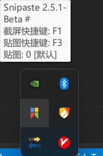

[中文](https://github.com/LCiZY/HideTrayIcon#readme) **|** English

# HideTrayIcon

Hide/Show TrayIcon for 64bit Windows 10.

# Function

```c++
// tray_icon.h & tray_icon.cpp
// get the handle of expanded trayIcon window
HWND FindOverflowTrayWindow();
//  get the handle of taskbar's trayIcon window
HWND FindNormalTrayWindow();

// set the visibility of trayIcons in taskBar and overflow area
// @param hWnd: the handle of window where the trayIcon is located
// @param process_name_or_tooltips: the element of the vector could be a subString of process name or subString of trayIcon's tooltip
// @param visible: true: show, false: hide
// @param isHardDelete: hard delete the trayIcon, only take effect when visible = false
VOID SetTrayIconVisable(HWND hWnd, std::vector<std::string>& process_name_or_tooltips, bool visible, bool isHardDelete = true);
```


# Usage under command line：
**hideTrayIcon.exe -i 'list of icons'**

- example:
``` cmd
hideTrayIcon.exe -i 'Everything NVIDIA uTools.exe' [options]
-d --delay
	start-up delay in seconds
	default: 0
-r --recoverable (may not work)
	whether the icon can be restored to display, this is a experimental feature, only icons in overflow area can be recovered
-a --action
	show or hide, show only works if - r or --recoverable is passed to program when the program is run for the first time
	default: hide
-i --icon
	list of trayIcons, can be tooltip and processName, separated by space
	eg. -i Everything
	eg. -i 'Everything NVIDIA uTools.exe'
	eg. -i 'Goland{space}2021.1.3' # \"Goland 2021.1.3\" contain space
	eg. -i 'Carl{squotation}s{space}cat' # \"Carl's cat\" contain single quotation mark and space
	eg. -i 'Robert{space}Frost{squotation}s{space}{dquotation}Design{dquotation}.' # \"Robert Frost's \"Design\".\" contain single quotation mark and double quotation mark and space
	mandatory
```
> - **5** means the program starts with a delay of 5 seconds
>
> - choose between **hide** and **show** to hide or show the tray icon respectively.
>
> - **Text** can be part of the text contained in the tray tooltip, or it can be the process name, and multiple "Text" can be passed

## Execute the program after 10 seconds of power on
**STEP 1**: Create a vbs file in the directory where hideTrayIcon.exe is located and enter the following code:

```vbscript
Set ws = CreateObject("Wscript.Shell")
ws.run "cmd /c hideTrayIcon.exe -a hide -d 10 -i ""Everything NVIDIA uTools.exe others""", vbhide
```
explanation:

```
-a hide # hide the icon
-d 10 # 10 seconds delay before executing the action
-i ""Everything NVIDIA uTools.exe""  # Indicates that the tray is to be hidden if the prompt text or the process name contains Everything or NVIDIA or uTools.exe
# in vbscript, " is represent by ""
```

Replace **others** with the part of tooltip or part of process path of the trayIcon you want to hide

eg: For the Snipaste's tray icon show below, we can replace Text with *Snipaste 2.5.1* or *Beta* or *Snipaste .exe*



**STEP 2**: Note: If there are non-ascii characters in the vbs script file (e.g. Chinese), you need to open the vbs file with Notepad and re-save it with ascii encoding.

**STEP 3**: Put the shortcut to the vbs file in the `C:\ProgramData\Microsoft\Windows\Start Menu\Programs\Startup` directory
